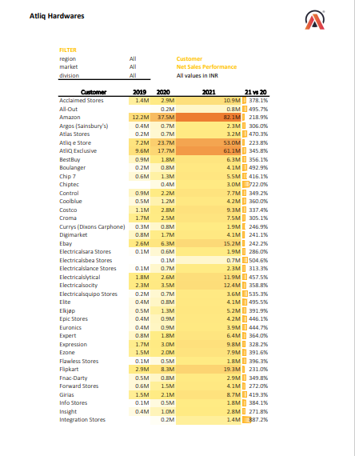
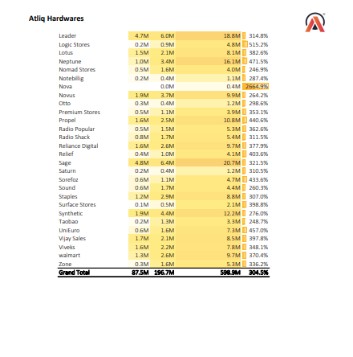

# Atliq Hardwares Analysis

## Overview

This repository contains an in-depth analysis of Atliq Hardwares' performance based on the Customer Performance Report and P&L Statements by Fiscal Year and Markets. The analysis was conducted using a robust ETL (Extract, Transform, Load) process to ensure data accuracy and consistency.

## Table of Contents

- [Introduction](#introduction)
- [Data Sources](#data-sources)
- [ETL Process](#etl-process)
- [Analysis Highlights](#analysis-highlights)
  - [Customer Performance Report](#customer-performance-report)
  - [P&L Statement by Fiscal Year](#pl-statement-by-fiscal-year)
  - [P&L Statement by Markets](#pl-statement-by-markets)
- [Acknowledgements](#acknowledgements)
- [Contributing](#contributing)
- [License](#license)

## Introduction

This project aims to analyze the performance of Atliq Hardwares by examining their sales, cost of goods sold (COGS), and gross margins across various customers, fiscal years, and markets. The insights derived from this analysis can help in strategic decision-making and performance improvement.

## Data Sources

- **Customer Performance Report**: Details the net sales performance of various customers from 2019 to 2021.
- **P&L Statement by Fiscal Year**: Provides a summary of net sales, COGS, and gross margin by fiscal year from 2019 to 2021.
- **P&L Statement by Markets**: Summarizes the financial performance across different markets for the fiscal year 2021.

## ETL Process

The ETL process for this analysis involved:

1. **Extract**: Data was collected from various internal sources including sales databases, customer records, and financial systems.
2. **Transform**: The data was cleaned, normalized, and aggregated to ensure consistency and accuracy.
3. **Load**: The transformed data was loaded into a data warehouse for analysis and reporting.

## Analysis Highlights

### Customer Performance Report

- **Acclaimed Stores**: 1.4M in 2019 to 10.9M in 2021, a 378.1% increase.
- **Amazon**: 12.2M in 2019 to 82.1M in 2021, a 218.9% rise.
- **AtliQ Exclusive**: 9.6M in 2019 to 61.1M in 2021, a 345.8% growth.
- *(Detailed performance data for all customers is available in the report.)*

### P&L Statement by Fiscal Year

- **Net Sales**: Grew from 87.5M in 2019 to 598.9M in 2021.
- **COGS**: Increased from 51.2M in 2019 to 380.7M in 2021.
- **Gross Margin**: Increased from 36.2M in 2019 to 218.2M in 2021.
- *(Full fiscal performance data is available in the report.)*

### P&L Statement by Markets

- **USA**: Leading with 87.78M in net sales and a gross margin of 37.0%.
- **India**: Significant market with 161.26M in net sales and a gross margin of 32.0%.
- **United Kingdom**: Achieved 34.15M in net sales with a 45.1% gross margin.
- *(Detailed market performance data is available in the report.)*

## Acknowledgements

A huge thank you to **Codebasics**, **Dhaval Sir**, and **Hemanand Sir** for their invaluable guidance and support in this analytical journey.

